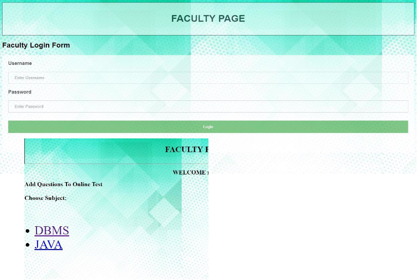
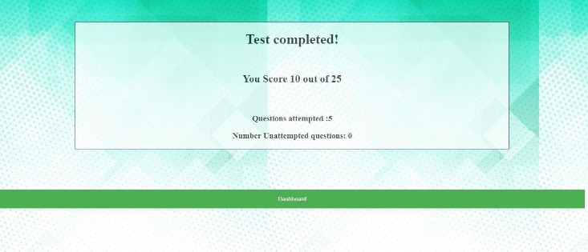

`                     `**ONLINE EXAMINATION SYSTEM** 

1) **Login page** 

2) **Create your Account (If not registered)** 

3) **If password and confirmation password do not match we get an error** 

4) **Faculty Login Page** 

5) **Add MCQ to the selected test** 

6) **After Clicking on submit we get** 

7) **After Successful Login** 

8) **Trying to attempt a test already submitted **
9) **Checking rank (If both tests are attempted, the marks will be added to an arraylist of student class object which is then sorted using comparator. NOT USED SORT BY OF SQL)** 

10) **Logging into a new Profile who has not attempted both the tests** 

11) **Checking rank when both( or one of the) tests are not attempted** 

    

12) **Attempting a test** 

13) **Result page after submitting the test (The test will automatically end after 60 seconds )** 

14) **Checking rank after submitting the test** 

